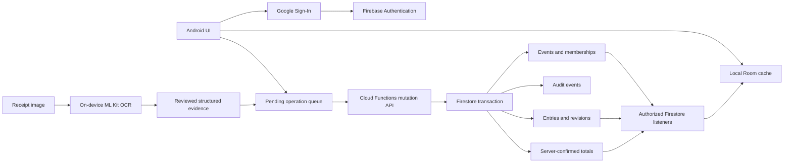

# Shared Ledger Implementation Plan

Last reviewed: 17 July 2026

## Status And Provisional Decisions

User requirement: one joined event should show authorized users the same members, reviewed receipt submissions, contributor activity, transactions, Total Collected, Total Spent, Available Balance, utilization, event details, and custom information.

Decision state:

- `BUILD`: collision-safe local event identity, completed in the current unreleased source.
- `BUILD`: the authenticated server-authority contract in local `demo-community-ledger` emulators.
- `BUILD`: Android debug shared mode and API 36 two-client emulator convergence, completed in the current unreleased source.
- `DEFER`: production Firebase resources, Play production, and public live-shared-ledger claims until owner-controlled cloud and physical-device gates pass.

Provisional product choices made while owner input is unavailable:

- Firebase is the emulator backend candidate, using the non-production `demo-community-ledger` project ID.
- Silent anonymous Firebase Auth identifies each debug installation without a visible login. Production recovery/account-linking policy remains an owner decision.
- India-first launch planning. No deployment region is pinned by the emulator code; permanent data region and cloud ownership remain production approval gates.
- Sync reviewed structured evidence only. Receipt images are out of scope for v1: no server field, upload endpoint, or cloud-storage bucket is created for them. Any future image upload requires a new ADR, privacy review, retention/deletion design, and Play Data safety review.
- Use Firebase Authentication, Cloud Firestore listeners, callable/HTTPS Cloud Functions, and Firebase App Check with Play Integrity as the first architecture candidate.
- Use Firebase Realtime Database for member-only approximate presence after membership authorization is proven. Presence labels are `Active now`, `Recently active`, and `Unavailable`; exact online/offline and precise last-seen claims are forbidden.
- Clients do not write confirmed events, membership, entries, totals, or audit records directly to Firestore.
- Do not create a cloud project, choose a permanent data region, enable billing, or deploy until the accountable owner approves those irreversible/operational choices.

No production Firebase resource or account was created. Local emulator configuration and tests now exist under `firebase/`.

## Implemented Emulator Contract

The current emulator-only source implements and tests:

| Area | Implemented now | Still planned |
|---|---|---|
| Accounts | Silent anonymous Android Auth; Auth and App Check callable enforcement | Production App Check/Play Integrity, account recovery/linking, session/device revocation |
| Events | Atomic server event + organizer membership; strict public profile; explicit public viewer join | Metadata edit, close event, existing-ledger upload |
| Membership | Private contributor/viewer invite creation and acceptance; joined/role counts | Revoke membership callable, role changes, organizer transfer, invite revocation |
| Entries | Structured evidence, reliable receipt-derived amount provenance, pending/confirmed/rejected states, organizer confirm/reject, minor-unit totals, member aggregates | Correction/void revisions, reconciliation job, event limits |
| Duplicates | Strong normalized reference and amount-plus-fallback-pair reservations | Organizer fallback-review UI and operational dispute workflow |
| Reads | Active-member event/member/entry projections; pending/rejected restricted to organizer/submitter; private evidence organizer/submitter only; Android role-aware listeners | Pagination and production reconciliation |
| Presence | Member-only approximate states, own writes, server access leases, membership grant/revoke mirror, Android lifecycle heartbeat | Production metrics and reconciliation operations |
| Offline | Server idempotency and expected-revision conflict rejection; Room pending queue; restart replay; bounded retry; revocation blocking and live-state cleanup | User-controlled failed-operation resolution and production conflict support |
| Operations | Pinned emulator toolchain and deny-by-default rules | Production ownership, region, billing, rate limits, monitoring, retention, deletion/export, incident response |

The backend emulator suite passes 51 tests. The Android API 36 convergence gate passes one end-to-end test covering two anonymous clients, invite/join, joined-member visibility, approximate presence, pending evidence review, confirmation, and equal final history/totals. This is a working debug/emulator integration, not a deployed production service.

## Why The Current Link Cannot Sync

The current event-copy URL contains an opaque copy key plus limited metadata. It has no authenticated user, server event, membership record, change feed, conflict protocol, or authority to accept financial writes. A URL cannot safely answer who joined, who submitted a receipt, who may edit a total, or which device has the authoritative state.

The version-5 opaque key fixes local Room-ID collisions only. It is not an access token or server identity.

## Proposed Architecture



### Authority Boundary

- Firebase Authentication verifies account identity.
- Firestore Security Rules authorize reads by active membership.
- Cloud Functions authorize and validate every mutation.
- One Firestore transaction writes the idempotency result, confirmed entry or correction, duplicate reservation, event/member aggregate deltas, event revision, and audit event. A failed transaction exposes none of them.
- Room is an offline cache and pending-work store, not the cross-device authority.
- Receipt OCR remains evidence requiring human review; an authenticated uploader is not proof that OCR fields are correct.

Direct client writes to confirmed ledger collections must be denied. This avoids client-calculated totals, role escalation, silent overwrite, and forged audit records.

Cloud Functions use the Admin SDK and therefore bypass Firestore Security Rules. The defense is deliberately layered: rules deny protected client writes, callable functions require valid Auth and App Check where supported, and function code independently reads current membership and validates every operation inside the transaction. Rules cannot compensate for a vulnerable function, so both rules and functions require emulator tests.

## Server Data Contract

All server IDs are opaque strings. Money uses integer minor units, not floating-point values.

### Event

```text
eventId
ownerUid
title
duration
visibilityPolicy
customInfo
status: active | closed
revision
totalCollectedMinor
totalSpentMinor
confirmedReceiptCount
currency: INR
createdAtServer
updatedAtServer
```

INR uses two fractional digits, so one rupee is 100 minor units. Amounts must be positive signed 64-bit integers below an owner-approved event limit. `availableBalanceMinor` is derived as collected minus spent. Utilization is derived as `totalSpentMinor / totalCollectedMinor * 100` when collected is positive and can exceed 100 for an overspent event. Clients do not submit totals, balance, utilization, counts, or aggregate deltas.

### Membership

```text
eventId
uid
role: organizer | contributor | viewer
status: active | revoked
displayName
confirmedReceiptCount
confirmedMoneyInMinor
confirmedMoneyOutMinor
joinedAtServer
revokedAtServer
```

Email and phone are not copied into every event by default. Optional contact data requires a clear event purpose and user choice.

### Ledger Entry

```text
entryId
eventId
revision
status: confirmed | corrected | voided
ledgerType: Donated | Credit | Debit | Expense
amountMinor
currency
ledgerPersonId
ledgerPersonDisplayNameSnapshot
submittedByUid
reviewedByUid
paymentApp
paymentDate
counterparty
paymentReference
confidence
warnings
idempotencyKey
createdAtServer
supersedesEntryId
```

The emulator prototype currently uses `pending | confirmed | rejected`. `corrected | voided` remain planned revision states.

The OCR counterparty remains separate from the ledger person and authenticated uploader. Raw OCR text and receipt images are not synchronized in v1. Payment references are stored only in an organizer/submitter-authorized private entry document; other members receive a redacted entry summary. Optional identifiers require privacy review and minimization before launch.

### Audit Event

```text
auditId
eventId
actorUid
action
subjectId
beforeRevision
afterRevision
reason
createdAtServer
```

Financial corrections append a new revision and audit event. They do not erase the prior record silently.

### Read Projections And Role Matrix

Firestore cannot redact individual fields from an otherwise readable document, so public/member summaries and private evidence must be separate documents written in the same server transaction.

| Data | Organizer | Contributor | Viewer | Revoked/non-member |
|---|---|---|---|---|
| Event metadata, custom info, confirmed totals/utilization | Read | Read | Read | Deny |
| Active member display names, roles, server-derived counts/totals | Read | Read | Read | Deny |
| Redacted confirmed entry summaries | Read | Read | Read | Deny |
| Payment reference/private structured evidence | Read | Own submissions only | Deny | Deny |
| Full membership administration and invite records | Read | Deny | Deny | Deny |
| Full audit records | Server-only in current emulator prototype; organizer projection planned | Deny | Deny | Deny |
| Redacted activity feed | Read | Read | Read | Deny |

All protected client writes are denied. Organizer, contributor, and viewer mutations go only through the bounded function API. Contributors may submit reviewed evidence but cannot confirm their own role change, modify event policy, correct another person's entry, or change aggregates. Viewers have no mutation authority.

## Mutation API

The server API exposes bounded operations rather than generic document writes. Current emulator exports are marked **implemented**:

- `createSharedEvent` - implemented
- `updateEventMetadata`
- `createSharedInvite` - implemented
- `acceptSharedInvite` - implemented
- `joinPublicSharedEvent` - implemented
- `revokeMembership`
- `changeMemberRole`
- `submitSharedEntry` - implemented
- `reviewSharedEntry` - implemented
- `refreshSharedPresence` - implemented
- `correctEntry`
- `voidEntry`
- `closeEvent`

Every mutation receives an authenticated user, event revision where applicable, and a random idempotency key. Retrying the same request returns the original result and cannot double-count money.

Idempotency contract:

- the client creates a 128-bit-or-stronger random operation UUID and persists it before the first network attempt
- scope is authenticated UID plus operation key; reuse anywhere by that UID is rejected unless operation type, event ID, and canonical payload hash exactly match
- the server stores the committed result, generated entry/audit IDs, operation type, event ID, and canonical SHA-256 payload hash in the same transaction as the mutation
- a failed Firestore transaction creates no idempotency record, so the exact request may retry with the same key
- a committed key with a different payload fails closed
- records remain for at least the event/audit retention period and never expire sooner than the supported offline queue window

The server generates the entry ID and returns it through the committed idempotency result.

### Duplicate Submission Contract

Idempotency prevents request retries; it does not detect two devices intentionally creating different keys for one receipt.

- A normalized, labelled payment reference creates an event-scoped strong duplicate key. The server stores only a keyed hash and reserves it in the same transaction as the entry.
- Without a strong reference, the server evaluates the existing fallback evidence set: amount plus at least two of payment date, payment app, and normalized counterparty.
- A strong match rejects the submission without changing totals.
- A fallback match remains pending for organizer review and cannot change confirmed totals until resolved.
- Corrections and voids update duplicate/aggregate state in the same transaction and preserve prior audit evidence.

## Invites And Membership

- The emulator derives pseudorandom invite IDs and 256-bit secrets from an HMAC key plus the organizer-scoped idempotency key. The URL carries `inviteId.secret`, not ledger data or a Room ID. Production must bind the HMAC key through managed secrets and preserve uniqueness/rotation policy.
- Store the invite ID plus SHA-256 of the high-entropy secret, purpose, event ID, intended role, expiry, creator, use limit, use count, and revocation state. Verify the decoded secret hash with a constant-time comparison.
- Validate expiry against server time and increment use count atomically with membership creation.
- Acceptance creates server membership only after authentication.
- Revoking an unused invite blocks future acceptance but does not revoke memberships already created from it. Membership revocation is a separate organizer operation that blocks future server reads/writes and is recorded in the audit history.
- Do not reveal private event metadata until authentication, token validation, and successful membership creation.
- Public events expose only a reviewed public profile before joining. A signed-in user must explicitly join before reading member or ledger projections.
- Public/private becomes a server authorization policy, not a dashboard marker.

## Presence And Joined Counts

- Active membership documents are the authority for joined counts and role counts.
- Presence is stored separately from ledger data and cannot create membership or authorize a read.
- A client may write only its own presence after authentication and active-membership verification.
- Active membership grants a two-minute server lease mirrored into Realtime Database. An authenticated/App Check refresh rechecks Firestore membership before extending it. Stale leases and stale presence records fail closed; Android disconnect handling is still planned.
- Only active event members can read event presence. Public profiles never expose presence or precise activity history.
- `Active now` means a recent authorized heartbeat, not guaranteed foreground use. `Recently active` is coarse and privacy bounded. `Unavailable` covers offline, hidden, stale, or unknown state.
- Financial activity uses redacted audit events such as entry submitted, confirmed, corrected, role changed, or member revoked. It does not infer activity from presence.

The existing event-copy links remain a separate local-only feature during migration and must keep their current truthful wording.

## Offline And Conflict Rules

- New submissions are visibly `Pending` until the server confirms them.
- Pending amounts do not silently enter server-confirmed totals.
- Room persists pending operations across restart with their idempotency keys.
- Reconnect retries are bounded and idempotent.
- A stale event revision returns a conflict; the app refreshes and asks the user to review rather than overwriting.
- Every mutation reads current active membership inside its server transaction. Cached membership is only a UX hint, so a revoked user cannot flush previously queued writes.
- On observed revocation, the app marks queued operations `Blocked`, stops retries, and purges the event's synchronized cache after offering only a local pending-work discard/export path approved by the privacy design. It never silently moves blocked work into another event.
- A server listener snapshot is authoritative and updates the Room confirmed cache transactionally. Pending rows live separately and are never overwritten by listener refresh.
- Listener disconnect/staleness is visible with the last server-confirmed time. The UI never labels cached totals live while disconnected.
- Different idempotency keys still pass through server duplicate detection.
- The UI shows confirmed totals separately from pending local submissions.
- Server timestamps order audit events; device clocks are not authoritative.

Revocation cannot recall information already downloaded to an offline or compromised phone. The app minimizes cached fields, never caches receipt images from the server in v1, purges on reconnect when revocation is learned, and discloses this residual limit. No UI may call revocation retroactive erasure.

## Local Migration

The current Room `eventKey` prepares a local mapping boundary but must not become the server's proof of ownership.

1. Add nullable `remoteEventId`, `syncState`, and server revision fields through an explicit Room migration only after the server contract is fixed.
2. Existing local events remain local by default.
3. An authenticated organizer explicitly chooses **Create shared event from this local ledger**.
4. Show the exact fields and entries that will leave the device before upload.
5. The server creates the remote event and returns its ID.
6. Store the local-to-remote mapping only after server confirmation.
7. Never auto-merge an existing event-copy shell with a server event based on title, email label, or opaque local copy key.

## Security And Privacy Gates

- Firestore rules deny unauthenticated access and direct confirmed-ledger writes.
- Cloud Functions recheck role, event status, amount, type, idempotency, and expected revision.
- App Check is defense in depth, not authentication.
- Secrets and service-account credentials never enter the APK or repository.
- Logs exclude receipt text, payment references, member contacts, invite tokens, and structured evidence payloads.
- Rate limits apply to sign-in, invite creation/acceptance, and write functions.
- Account/device revocation, export, deletion, retention, backup, incident response, and support ownership are documented before production.
- Play Data safety and the Privacy Policy are rewritten for account, member, financial, and diagnostics data before any backend-enabled test release.

### Security Rules Contract

Before Slice 1 code is accepted, emulator-tested rules must prove:

- unauthenticated, non-member, and revoked reads fail
- each active role can read only the projections in the role matrix
- contributors cannot read another submitter's private evidence
- viewers cannot read private evidence, invite documents, or full audit records
- every direct client create/update/delete on confirmed events, memberships, entries, aggregates, duplicate keys, idempotency records, invites, and audit documents fails
- malformed or missing membership documents fail closed

Cloud Function tests separately prove current-role checks, sole-organizer protection, expected-revision checks, amount/range/type validation, event-closed behavior, App Check policy, duplicate behavior, and idempotent atomic totals/audit results.

### Account And Device Recovery

- v1 account authentication depends on Google account recovery; support has no identity-bypass mechanism.
- An organizer may add a second organizer through an explicit audited role change.
- The sole active organizer cannot remove, revoke, or demote themselves.
- Ownership transfer is two-step: the target authenticated organizer accepts, then the current owner confirms; both actions are audited.
- Account deletion requires transferring or closing owned events and follows the approved retention/deletion policy.
- Device/session revocation must invalidate server refresh tokens or an app session registry; local sign-out alone is not described as remote device revocation.
- If the only organizer permanently loses the Google account before transfer, recovery is not guaranteed. This limit remains visible unless an independently reviewed recovery process is built.

## Delivery Slices

### 0. Owner Approval

Required before external resource creation:

- Google/Firebase project owner and billing owner
- permanent Firestore/Functions data region
- initial launch countries
- support, privacy, incident-response, and deletion-request owner
- retention period for account, audit, and structured receipt evidence
- supported offline queue duration and corresponding idempotency retention
- event/account recovery and organizer-transfer policy
- per-operation abuse/rate-limit policy and cost alerts

### 1. Local Emulator Contract

- Status: server emulator contract complete for the currently implemented operations. Android auth/listener integration is not implemented.
- Add Firebase Emulator Suite configuration without production credentials.
- Implement Google-auth abstraction with a test identity provider.
- Implement one server-created event, organizer membership, and authorized read listener.
- Implement and test the read-projection/security-rules matrix with synthetic accounts and no production credentials.
- Prove unauthenticated, non-member, revoked, and direct-write access fails.
- Prove an idempotent create-event retry returns the original server event and cannot duplicate organizer membership or audit history.

### 2. Membership And Revocable Invites

- Add server-generated invites, authenticated acceptance, roles, and revocation.
- Prove invite expiry/use/revocation, sole-organizer protection, and that the recipient appears as a member on both clean devices.

### 3. Reviewed Entry And Totals

- Submit reviewed structured evidence through an idempotent function.
- Atomically write idempotency, duplicate reservation, private/redacted entry records, audit, event/member aggregate deltas, and revision.
- Prove retry, transaction failure, two-device strong duplicate, fallback duplicate review, correction, and void cannot double-count or leave partial totals/audit.

### 4. Offline Queue And Conflicts

- Persist pending operations in Room.
- Separate pending from confirmed totals.
- Prove restart, reconnect, listener replacement, duplicate keys, stale revision, membership revocation, blocked-operation handling, and visible stale-cache behavior.

### 5. Existing-Ledger Migration

- Add explicit opt-in upload with preview and cancellation.
- Prove no silent upload, no duplicate totals, and no wrong-event merge.

### 6. Production Readiness

- Two-device acceptance matrix.
- Security Rules and Cloud Functions emulator tests.
- App Check/Play Integrity validation.
- Privacy, Data safety, export/deletion, retention, incident-response, cost-alert, backup, and recovery runbooks.
- Qualified legal review for intended jurisdictions.
- Reconciliation job or verifier recomputes event/member aggregates from confirmed entry revisions and alerts on any mismatch without silently rewriting production data.

## Definition Of Done

The debug/emulator milestone is complete when two isolated authenticated clients converge on the same server-confirmed membership, entries, and totals; pending evidence requires organizer review; retries remain idempotent; presence is approximate; and receipt images remain local. Production completion additionally requires physical-device, cloud ownership, recovery, privacy, operations, abuse, monitoring, reconciliation, and release evidence.

## Current Blocker

Android debug shared mode is implemented and accepted against local emulators. Production resources remain blocked because no approved backend owner, billing owner, permanent data region, recovery policy, abuse limits, incident owner, or production account exists. Membership revoke/leave/role-change APIs, corrections/voids, production presence operations, pagination, monitoring, export/deletion, reconciliation, and physical two-phone acceptance remain incomplete. Play production remains deferred and the published beta remains an explicitly local organizer ledger.
